# 测试报告
### 基于CloudWeGo的网关API开发--大作业测试报告
### 测试人：刘克典  &nbsp;&nbsp; &nbsp;  测试平台：Ubuntu20.04         &nbsp; &nbsp;  测试时间：2023/7/28
## 1. 性能测试
 
性能测试基于Golang性能测试框架Benchmark及第三方性能测试工具Apache Benchmark进行
 
### 1.1  基准测试
 
使用Benchmark向FirstLevelService发送请求，显示数据：
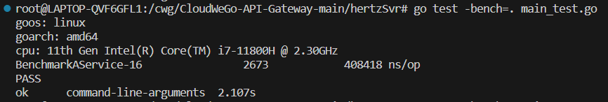
 
- 共使用：16个核心
- 处理次数：2673次
- 每次耗时：408418ns
 
使用Benchmark向SecondLevelService发送请求，显示数据：
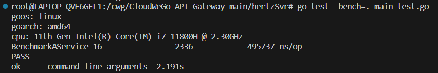
 
- 共使用：16个核心
- 处理次数：2336次
- 每次耗时：495737ns
 
使用Benchmark向AdvancedLevelService发送request请求，显示数据：
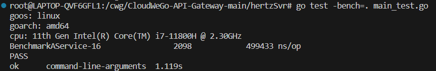
 
- 共使用：16个核心
- 处理次数：2068次
- 每次耗时：499433ns
 
测试报告解读：可以看到，向SecondLevelService和AdvancedLevelService发送请求的每次耗时差别不大，向FirstLevelService发送请求的每次耗时相对较少，是因为我们在FirstLevel服务中加入了Service-1 和 Service-2服务，实现了负载均衡，减轻FirstLevel服务压力。

### 1.2  并行测试
用于测量在并发情况下性能指标，可反映被测代码的横向可扩展性
 
基于Benchmark设置最大并发数为2，显示数据：
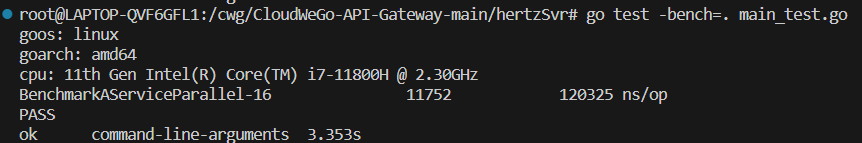
 
- 共使用：16个核心
- 处理次数：11752次
- 每次耗时：120325ns
 
基于Benchmark设置最大并发数为4，显示数据：

 
- 共使用：16个核心
- 处理次数：10191次
- 每次耗时：98958ns
 
基于Benchmark设置最大并发数为8，显示数据：
 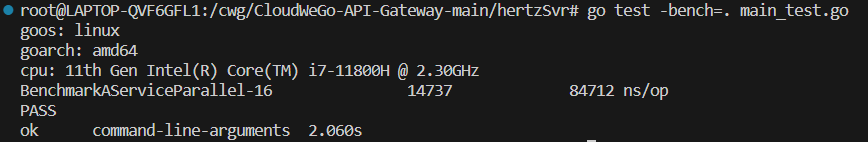
- 共使用：16个核心
- 处理次数：14737次
- 每次耗时：84712ns
 
基于Benchmark设置最大并发数为16，显示数据：
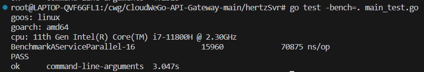
 
- 共使用：16个核心
- 处理次数：15960次
- 每次耗时：70875ns
 
测试报告解读：并发数增加，每次耗时会逐渐减少，但被测代码往往有共享资源（例如锁，内存，CPU等），性能指标不一定会随并发数线性增长。
 
### 1.3  内存指标
 
用于观察被测代码的内存相关信息
 
基于Benchmark测试向FirstLevelServce发送请求，内存指标显示：

 
- 每个操作分配5507个字节
- 单次迭代产生了68个不同的内存分配
 
基于Benchmark测试，设置并发数为4，向FirstLevelService发送请求，内存指标显示：
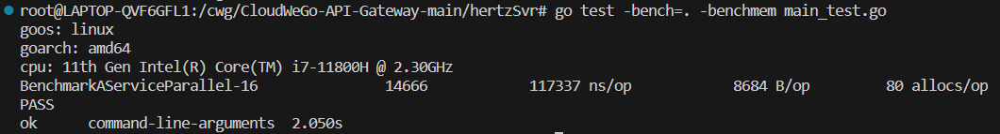
 
- 每个操作分配8684个字节
- 单次迭代产生了80个不同的内存分配
 
### 1.4  Apache Benchmark 测试
使用AB向FirstLevelService发送请求，在Service-2服务开启之前的数据显示：
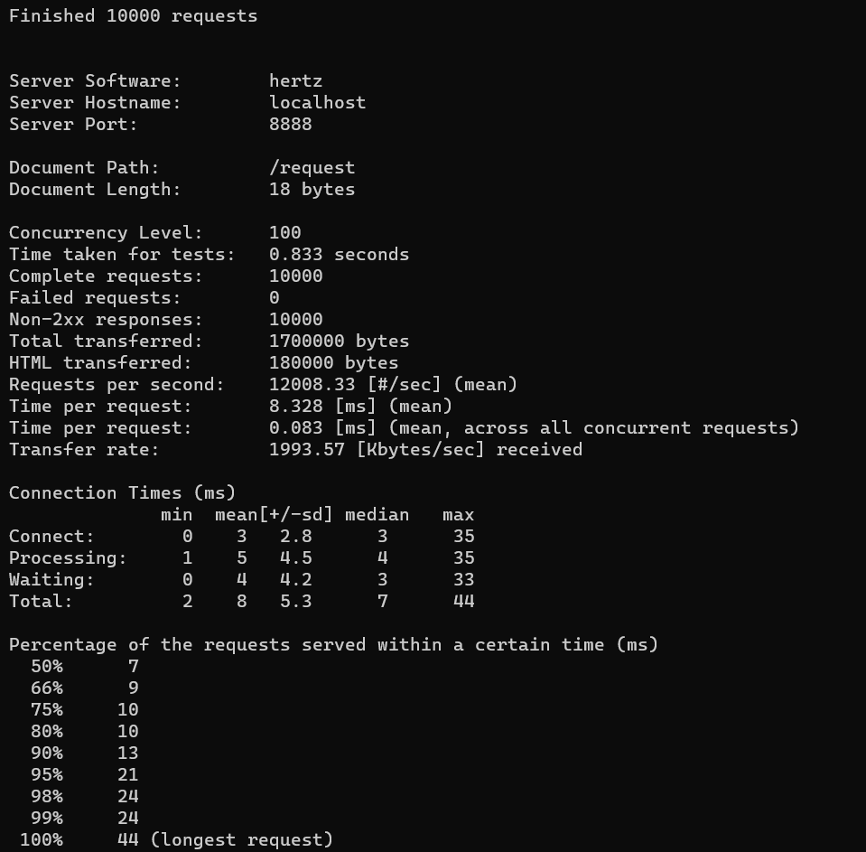
 
- Concurrency Level: 100
- Complete requests: 100000
- 每秒发送12008个请求
- 95%的请求在21ms内完成
- 99%的请求在24ms内完成
- 100%的请求在44ms内完成
 
使用AB向ServiceA发送请求，在ServiceA-2服务开启之后的数据显示：
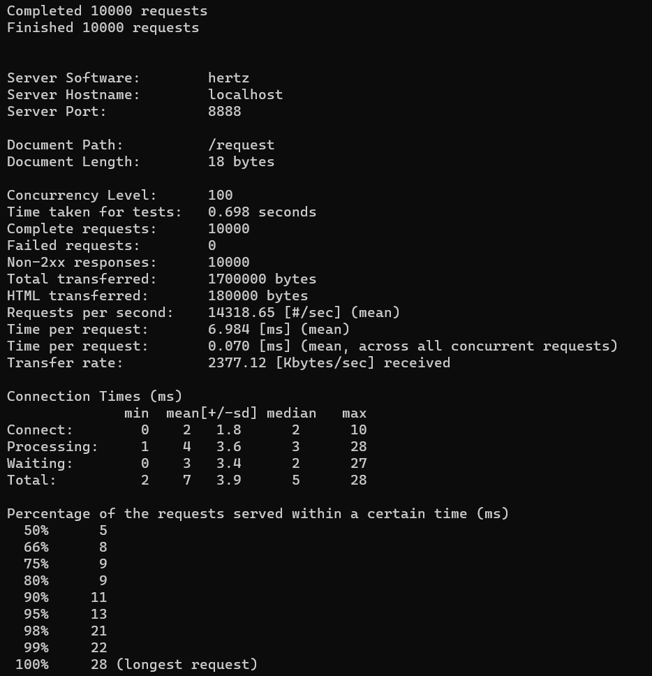
 
- Concurrency Level: 100
- Complete requests: 100000
- 每秒发送14318个请求
- 95%的请求在13ms内完成
- 99%的请求在22ms内完成
- 100%的请求在28ms内完成
 
测试报告解读：开启ServiceA-2之后，可以实现负载均衡，分担ServiceA-1的压力，使得每秒发送请求数上升，请求完成时间缩短，请求质量提升。
 
## 2. 优化视图

### 2.1  pprof 测试 命令行输出结果

使用pprof对Benchmark测试进行优化观测，数据产出显示：
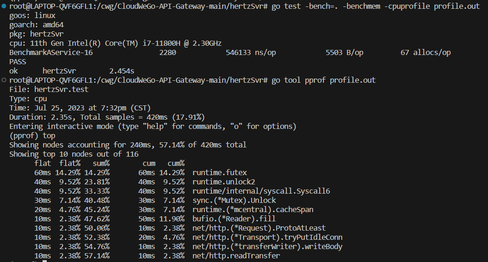
 
- flat flat%：
一个函数内的directly操作的物理耗时。flat一般是我们最关注的。其代表一个函数可能非常耗时，或者调用了非常多次，或者两者兼而有之，从而导致这个函数消耗了最多的时间。
我们自己编写的代码，很可能有一些无脑for循环、复杂的计算、字符串操作、频繁申请内存等等

- cum cum%:
相比flat，cum则是这个函数内所有操作的物理耗时，比如包括了上述的step1、2、3、4。
cum%即是cum的时间/总运行时间。内存等参数同理。
一般cum是我们次关注的，且需要结合flat来看。flat可以让我们知道哪个函数耗时多，而cum可以帮助我们找到是哪些函数调用了这些耗时的（flat值大的）函数
 
数据分析：据此可以看出，futex和unlock2占据了相对较多的CPU运行时间，但程序总体性能较好，没有出现大量占据CPU的函数（如无脑的for循环和频繁申请内存等操作）
 
### 2.2  连线图
连线图Graph（局部图1）：
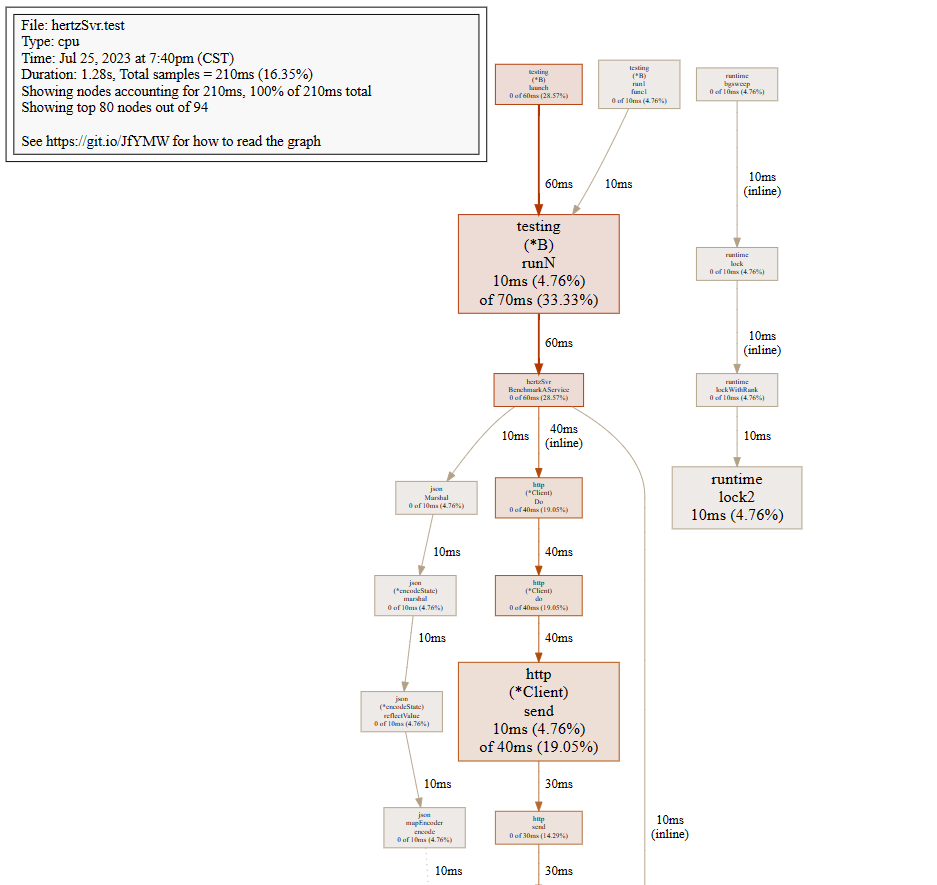
 
连线图Graph（局部图2）：
 
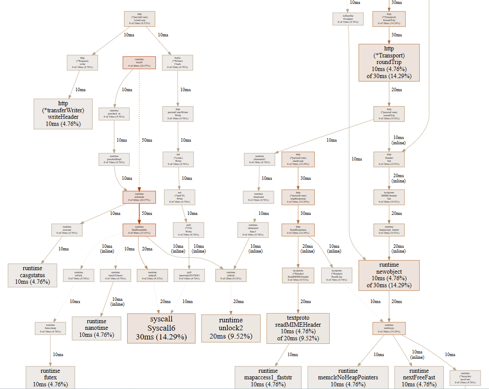
节点的颜色越红，其cum和cum%越大。其颜色越灰白，则cum和cum%越小。
节点越大，其flat和flat%越大；其越小，则flat和flat%越小
线条代表了函数的调用链，线条越粗，代表指向的函数消耗了越多的资源。反之亦然
 
数据分析：图中 testing包中的runN函数和http包中的send函数节点较大，颜色较深，但实际的flat占据并不是特别大，是可以考虑优化的部分。